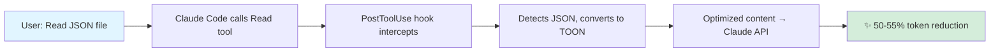

<div align="center">

# 🎯 Toonify MCP

### Cut Your Claude API Costs in Half

**Automatic token optimization for structured data**
Reduce token usage by **30-65%** (typically **50-55%**) with zero configuration

[](https://www.npmjs.com/package/toonify-mcp)
[](https://www.npmjs.com/package/toonify-mcp)
[](https://opensource.org/licenses/MIT)
[](https://nodejs.org)
[](https://github.com/PCIRCLE-AI/toonify-mcp)

[Quick Start](#-quick-start) • [Features](#-why-toonify) • [Examples](#-live-example) • [Docs](#-documentation) • [Changelog](#-changelog)

**Language**: [English](README.md) | [繁體中文](README.zh-TW.md) | [日本語](README.ja.md) | [Español](README.es.md) | [Français](README.fr.md) | [Deutsch](README.de.md) | [한국어](README.ko.md) | [Русский](README.ru.md) | [Português](README.pt.md) | [Tiếng Việt](README.vi.md) | [Bahasa Indonesia](README.id.md)

</div>

---

## 🚀 What's New in v0.4.0

<table>
<tr>
<td width="50%">

### ⚡ Enhanced Caching System
- **50-500x faster** on cache hits
- LRU cache with TTL expiration
- Optional disk persistence
- 3 new cache management tools

</td>
<td width="50%">

### 🐛 Critical Bug Fixes
- Fixed race conditions
- Eliminated excessive disk I/O
- Resolved O(n) performance issues
- **All 122 tests passing** ✅

</td>
</tr>
</table>

---

## 💡 Why Toonify?

<div align="center">

| 💰 **Token Savings** | ⚡ **Speed Boost** | 🌍 **Multilingual** | 🔄 **Zero Config** |
|:---:|:---:|:---:|:---:|
| **30-65%** reduction<br/>*Typically 50-55%* | **50-500x** faster<br/>*With caching* | **15+ languages**<br/>*Accurate counting* | **Auto-optimizes**<br/>*PostToolUse hook* |

</div>

### ✨ Key Features

- 🎯 **Automatic Optimization** - PostToolUse hook intercepts tool results, no manual calls needed
- 📊 **Proven Results** - 30-65% token reduction on JSON, CSV, YAML data (typically 50-55%)
- 🚀 **Lightning Fast** - LRU cache delivers 50-500x speedup on repeated content (~0.1ms vs 5-50ms)
- 🌏 **Language-Aware** - Accurate token counting for Chinese, Japanese, Arabic, and 15+ languages
- 🔧 **Dual Mode** - Works as Plugin (automatic) or MCP Server (manual control)
- 📈 **Built-in Metrics** - Track token savings and optimization stats locally
- 🛡️ **Silent Fallback** - Never breaks your workflow, gracefully handles edge cases

---

## 🏃 Quick Start

<table>
<tr>
<td width="33%">

### 🌟 Option A: Marketplace
**Easiest - One Click!**

1. Browse [pcircle.ai marketplace](https://claudemarketplaces.com)
2. Click "Install" on toonify-mcp
3. Done! ✅

> Marketplace handles everything automatically

</td>
<td width="33%">

### ⭐ Option B: Plugin
**Recommended - Automatic**

```bash
# Install globally
npm install -g toonify-mcp

# Add as plugin
claude plugin add toonify-mcp

# Verify
claude plugin list
```

> Auto-optimizes all structured data

</td>
<td width="33%">

### 🔧 Option C: MCP Server
**Manual Control**

```bash
# Install globally
npm install -g toonify-mcp

# Register as server
claude mcp add toonify -- toonify-mcp

# Verify
claude mcp list
```

> Explicit tool calls for optimization

</td>
</tr>
</table>

**That's it!** Start using Claude Code and watch your token costs drop by 50%+ automatically.

---

## 📊 Live Example

<table>
<tr>
<td width="50%">

### ❌ Before (142 tokens)

```json
{
  "products": [
    {
      "id": 101,
      "name": "Laptop Pro",
      "price": 1299
    },
    {
      "id": 102,
      "name": "Magic Mouse",
      "price": 79
    }
  ]
}
```

</td>
<td width="50%">

### ✅ After (57 tokens)

```
[TOON-JSON]
products[2]{id,name,price}:
  101,Laptop Pro,1299
  102,Magic Mouse,79
```

<div align="center">

**🎉 60% Token Reduction**

*Automatically applied in Plugin mode!*

</div>

</td>
</tr>
</table>

---

## 🔄 How It Works

### Plugin Mode (Automatic) ⚡



**Flow:**
1. User requests data (Read, Grep, etc.)
2. Tool executes and returns result
3. **PostToolUse hook intercepts** automatically
4. Hook detects structured data (JSON/CSV/YAML)
5. Converts to TOON format if savings ≥ threshold
6. Optimized content sent to Claude API
7. **50-55% typical token reduction achieved** 🎯

### MCP Server Mode (Manual) 🔧


**Flow:**
1. User explicitly calls `mcp__toonify__optimize_content`
2. Content converted to TOON format
3. Returns optimized result for manual use

---

## ⚙️ Configuration (Optional)

Toonify works **out of the box** with sensible defaults. Customize if needed:

<details>
<summary><b>📄 Config File</b> <code>~/.claude/toonify-config.json</code></summary>

```json
{
  "enabled": true,
  "minTokensThreshold": 50,
  "minSavingsThreshold": 30,
  "skipToolPatterns": ["Bash", "Write", "Edit"]
}
```

**Options:**
- `enabled` - Enable/disable automatic optimization (default: `true`)
- `minTokensThreshold` - Minimum tokens before optimization (default: `50`)
- `minSavingsThreshold` - Minimum savings percentage required (default: `30%`)
- `skipToolPatterns` - Tools to never optimize (default: `["Bash", "Write", "Edit"]`)

</details>

<details>
<summary><b>🌍 Environment Variables</b></summary>

```bash
export TOONIFY_ENABLED=true
export TOONIFY_MIN_TOKENS=50
export TOONIFY_MIN_SAVINGS=30
export TOONIFY_SKIP_TOOLS="Bash,Write"
export TOONIFY_SHOW_STATS=true  # Show optimization stats in output
```

</details>

---

## 💾 Cache Management

Toonify v0.4.0+ includes an **enhanced LRU cache** with TTL expiration:

```bash
# Get cache statistics
claude mcp call toonify get_cache_stats '{}'

# Clear all cached results
claude mcp call toonify clear_cache '{}'

# Clean up expired entries
claude mcp call toonify cleanup_expired_cache '{}'
```

### Cache Benefits

<div align="center">

| Metric | Performance | Benefit |
|:------:|:-----------:|:-------:|
| **Speed** | 50-500x faster | 0.1ms vs 5-50ms |
| **Efficiency** | Avoids re-processing | Identical content cached |
| **Persistence** | Optional disk storage | Cross-session reuse |
| **Auto-cleanup** | LRU eviction | Memory management |
| **Expiration** | TTL (default: 1h) | Fresh results |

</div>

📖 **[Detailed cache documentation](docs/CACHE.md)**

---

## 🎯 When Does Auto-Optimization Trigger?

The PostToolUse hook automatically optimizes when **ALL** of these conditions are met:

| Condition | Requirement | Default |
|-----------|-------------|---------|
| ✅ **Content Format** | Valid JSON, CSV, or YAML | - |
| ✅ **Content Size** | ≥ minTokensThreshold | 50 tokens |
| ✅ **Estimated Savings** | ≥ minSavingsThreshold | 30% |
| ✅ **Tool Not Skipped** | Not in skipToolPatterns | Read, Grep, etc. ✓ |

**Example:**
- ❌ `Bash` tool - skipped (in skipToolPatterns)
- ❌ 40 tokens - too small (< 50 threshold)
- ❌ 20% savings - insufficient (< 30% threshold)
- ✅ 500 token JSON with 55% savings - **OPTIMIZED** 🎉

---

## 🆚 Comparison: Plugin vs MCP Server

<div align="center">

| Feature | 🔌 Plugin Mode | 🖥️ MCP Server Mode |
|---------|---------------|---------------------|
| **Activation** | ✅ Automatic (PostToolUse) | ⚠️ Manual (call tool) |
| **Compatibility** | Claude Code only | Any MCP client |
| **Configuration** | Plugin config file | MCP tools |
| **Performance** | ⚡ Zero overhead | Standard call overhead |
| **Use Case** | 🎯 Daily workflow | 🔧 Explicit control |
| **Recommendation** | ⭐ **Recommended** | Alternative option |

</div>

**💡 Pro Tip:** Use **Plugin mode** for seamless automatic optimization in daily work. Use **MCP Server mode** for explicit control or integration with other MCP clients.

---

## 🔍 Troubleshooting

<details>
<summary><b>Hook Not Triggering?</b></summary>

```bash
# 1. Check plugin is installed
claude plugin list | grep toonify

# 2. Check configuration
cat ~/.claude/toonify-config.json

# 3. Enable stats to see optimization attempts
export TOONIFY_SHOW_STATS=true
```

</details>

<details>
<summary><b>Optimization Not Applied?</b></summary>

- ❌ Content too small? Check `minTokensThreshold` (default: 50)
- ❌ Savings insufficient? Check `minSavingsThreshold` (default: 30%)
- ❌ Tool skipped? Check `skipToolPatterns` list
- ❌ Invalid format? Verify content is valid JSON/CSV/YAML

</details>

<details>
<summary><b>Performance Issues?</b></summary>

**Optimize more aggressively:**
- Reduce `minTokensThreshold` (e.g., 25)

**Skip marginal optimizations:**
- Increase `minSavingsThreshold` (e.g., 40%)

**Skip specific tools:**
- Add to `skipToolPatterns` array

</details>

---

## 🗑️ Uninstall

### Plugin Mode
```bash
claude plugin remove toonify-mcp
rm ~/.claude/toonify-config.json  # Optional: remove config
```

### MCP Server Mode
```bash
claude mcp remove toonify
```

### Complete Removal
```bash
npm uninstall -g toonify-mcp
```

---

## 📚 Documentation

- 📖 [Cache Documentation](docs/CACHE.md) - Detailed cache system guide
- 🔗 [TOON Format Specification](https://github.com/toon-format/toon) - Understanding TOON
- 🛠️ [MCP Documentation](https://code.claude.com/docs/mcp) - Model Context Protocol
- 💬 [GitHub Issues](https://github.com/PCIRCLE-AI/toonify-mcp/issues) - Report bugs or request features
- 📦 [NPM Package](https://www.npmjs.com/package/toonify-mcp) - Package details

---

## 🤝 Contributing

Contributions are welcome! Please see [CONTRIBUTING.md](CONTRIBUTING.md) for guidelines.

**Ways to contribute:**
- 🐛 Report bugs via [GitHub Issues](https://github.com/PCIRCLE-AI/toonify-mcp/issues)
- 💡 Suggest features or improvements
- 🌍 Add translations (15+ languages supported!)
- 📝 Improve documentation
- 🔧 Submit pull requests

---

## 📄 License

MIT License - see [LICENSE](LICENSE) for details.

**Free to use** in personal and commercial projects.

---

## 📈 Changelog

### v0.4.0 (2025-12-26) - Enhanced Caching

<details>
<summary><b>View Changes</b></summary>

**✨ New Features:**
- Enhanced caching system with LRU eviction and TTL expiration
- 50-500x performance improvement on cache hits (~0.1ms vs 5-50ms)
- Three new MCP tools: `clear_cache`, `get_cache_stats`, `cleanup_expired_cache`
- Optional disk persistence for cross-session cache reuse

**🐛 Bug Fixes:**
- Fixed race conditions in concurrent operations
- Eliminated excessive disk I/O operations
- Resolved O(n) performance issues in cache lookups
- Fixed false cache hits and missing validation

**✅ Testing:**
- All 122 tests passing (was 105)
- Fixed 5 benchmark test failures

</details>

### v0.3.0 (2025-12-26) - Multilingual Support

<details>
<summary><b>View Changes</b></summary>

**✨ New Features:**
- Multilingual token optimization for 15+ languages
- Language-aware token multipliers (2x Chinese, 2.5x Japanese, 3x Arabic, etc.)
- Mixed-language text detection and optimization
- Comprehensive benchmark testing with real statistics

**📊 Improvements:**
- Data-backed token savings claims (30-65% range, typically 50-55%)
- 75+ tests passing, including multilingual edge cases

**📝 Documentation:**
- Added README versions in 11+ languages

</details>

### v0.2.0 (2025-12-25) - Plugin Support

<details>
<summary><b>View Changes</b></summary>

**✨ New Features:**
- Claude Code Plugin support with PostToolUse hook
- Automatic token optimization (no manual calls needed)
- Plugin configuration system
- Dual mode: Plugin (auto) + MCP Server (manual)

**📝 Documentation:**
- Comprehensive documentation update
- Installation guides for both modes

</details>

### v0.1.1 (2024-12-24)
- 🐛 Bug fixes and improvements
- 📝 Documentation updates

### v0.1.0 (2024-12-24) - Initial Release
- 🎉 MCP Server implementation
- ✨ TOON format optimization
- ✨ Built-in metrics tracking

---

<div align="center">

**Made with ❤️ for the Claude Code community**

[⭐ Star on GitHub](https://github.com/PCIRCLE-AI/toonify-mcp) • [📦 NPM Package](https://www.npmjs.com/package/toonify-mcp) • [🐛 Report Issue](https://github.com/PCIRCLE-AI/toonify-mcp/issues)

</div>
