# 🎨 Visual Assets Creation Guide

## Quick Reference

This guide provides step-by-step instructions for creating all recommended visual assets for the Toonify MCP GitHub repository.

---

## Asset Priority Matrix

| Asset | Impact | Effort | Priority | Status |
|-------|--------|--------|----------|--------|
| Hero Demo GIF | ⭐⭐⭐⭐⭐ | Medium | P0 | ⬜ Todo |
| Architecture Diagram | ⭐⭐⭐⭐ | Low | P0 | ⬜ Todo |
| Before/After Screenshot | ⭐⭐⭐⭐⭐ | Low | P0 | ⬜ Todo |
| Installation Walkthrough | ⭐⭐⭐ | Medium | P1 | ⬜ Todo |
| Cache Performance Graph | ⭐⭐⭐ | Low | P1 | ⬜ Todo |
| Multilingual Example | ⭐⭐ | Low | P2 | ⬜ Todo |
| Config Flowchart | ⭐⭐ | Medium | P2 | ⬜ Todo |

---

## P0: Critical Assets (Implement First)

### 1. Hero Demo GIF

**Purpose**: Show automatic optimization in action

**What to Record**:
1. Claude Code reading a large JSON file (package.json or API response)
2. Console output showing "Optimizing content..."
3. Token count reduction displayed (e.g., "142 → 57 tokens (-60%)")
4. File content still accessible in TOON format

**Recording Steps**:

```bash
# Setup
cd ~/Desktop/demo-recording
mkdir toonify-demo && cd toonify-demo

# Create demo JSON file
cat > large-sample.json << 'EOF'
{
  "users": [
    {"id": 1, "name": "Alice Johnson", "email": "alice@example.com", "role": "admin"},
    {"id": 2, "name": "Bob Smith", "email": "bob@example.com", "role": "user"},
    {"id": 3, "name": "Carol White", "email": "carol@example.com", "role": "user"},
    {"id": 4, "name": "David Brown", "email": "david@example.com", "role": "moderator"}
  ],
  "settings": {
    "theme": "dark",
    "notifications": true,
    "language": "en-US"
  }
}
EOF

# Start recording (macOS)
# 1. Open QuickTime Player
# 2. File → New Screen Recording
# 3. Select Claude Code window only
# 4. Start recording

# Demo steps (perform slowly, clearly)
# 1. In Claude Code, type: "Read the file large-sample.json"
# 2. Show the Read tool being called
# 3. Point to console output showing optimization
# 4. Highlight token reduction metrics
# 5. Show optimized TOON format in response

# Stop recording after ~10 seconds
# Save as toonify-demo-raw.mov
```

**Post-Processing**:

```bash
# Convert to GIF with Gifski (best quality)
gifski --fps 10 --quality 90 --width 800 toonify-demo-raw.mov -o toonify-demo.gif

# Optimize file size
gifsicle -O3 --lossy=80 -o toonify-demo-optimized.gif toonify-demo.gif

# Verify file size < 500KB
ls -lh toonify-demo-optimized.gif

# Move to repository
mv toonify-demo-optimized.gif /path/to/toonify-mcp/docs/assets/hero-demo.gif
```

**Specifications**:
- Duration: 8-10 seconds (loop)
- Size: < 500KB
- Dimensions: 800x600px
- FPS: 10
- Background: Dark theme (VS Code default)

**Markdown Integration**:

```markdown
<div align="center">


*Watch Toonify automatically optimize structured data with zero configuration*

</div>
```

**Location**: README.md, below hero section

---

### 2. Architecture Diagram (SVG)

**Purpose**: Show how PostToolUse hook integrates with Claude Code

**What to Include**:
1. Claude Code UI
2. User request (Read tool)
3. Tool execution
4. PostToolUse hook intercept
5. Toonify optimization
6. Optimized result to Claude API

**Creation with Mermaid**:

```mermaid
graph TB
    User[👤 User Request<br/>'Read large-sample.json']
    CC[🖥️ Claude Code UI]
    Tool[🔧 Read Tool<br/>Executes]
    Hook[⚡ PostToolUse Hook<br/>toonify-mcp]
    Detect[🔍 Detect Format<br/>JSON/CSV/YAML?]
    Optimize[✨ TOON Optimization<br/>142 → 57 tokens]
    API[🌐 Claude API<br/>Receives optimized content]
    Response[💬 Response to User<br/>With TOON data]

    User --> CC
    CC --> Tool
    Tool --> Hook
    Hook --> Detect
    Detect -->|Yes| Optimize
    Detect -->|No| API
    Optimize --> API
    API --> Response
    Response --> User

    style User fill:#e1f5ff
    style Hook fill:#fff3cd
    style Optimize fill:#d4edda
    style API fill:#f8d7da
    style Response fill:#d4edda
```



**Export as SVG**:

1. Go to [Mermaid Live Editor](https://mermaid.live)
2. Paste the diagram code
3. Click "Download SVG"
4. Save as `architecture.svg`

**Optimization**:

```bash
# Install SVGO (SVG optimizer)
npm install -g svgo

# Optimize SVG
svgo architecture.svg -o architecture-optimized.svg

# Move to repository
mv architecture-optimized.svg /path/to/toonify-mcp/docs/assets/architecture.svg
```

**Markdown Integration**:

```markdown
## How It Works - Architecture

<div align="center">


</div>
```

**Location**: README.md, "How It Works" section

---

### 3. Before/After Screenshot (PNG)

**Purpose**: Visual proof of token reduction

**What to Capture**:
1. Split-screen or side-by-side
2. Left: Original JSON (142 tokens)
3. Right: TOON format (57 tokens)
4. Highlight token counts
5. Show 60% reduction

**Creation Steps**:

```bash
# Setup demo environment
cd ~/Desktop/demo-screenshots
mkdir before-after && cd before-after

# Create demo script
cat > demo.js << 'EOF'
const { encode } = require('@anthropic-ai/tokenizer');
const toonify = require('toonify-mcp');

const original = `{
  "products": [
    {"id": 101, "name": "Laptop Pro", "price": 1299},
    {"id": 102, "name": "Magic Mouse", "price": 79}
  ]
}`;

const optimized = `[TOON-JSON]
products[2]{id,name,price}:
  101,Laptop Pro,1299
  102,Magic Mouse,79`;

console.log('=== BEFORE ===');
console.log(original);
console.log(`Tokens: ${encode(original).length}`);
console.log('');
console.log('=== AFTER ===');
console.log(optimized);
console.log(`Tokens: ${encode(optimized).length}`);
console.log('');
console.log(`Reduction: ${Math.round((1 - encode(optimized).length / encode(original).length) * 100)}%`);
EOF

# Run script
node demo.js

# Take screenshot (macOS)
# 1. Cmd + Shift + 4
# 2. Capture terminal output
# 3. Save as before-after-raw.png
```

**Annotation** (use Preview.app or Figma):
1. Add arrows pointing to token counts
2. Highlight reduction percentage
3. Add green checkmark for "After"
4. Add red X for "Before" (optional)

**Optimization**:

```bash
# Optimize PNG
pngquant --quality=80-95 before-after-raw.png -o before-after.png

# Move to repository
mv before-after.png /path/to/toonify-mcp/docs/assets/before-after.png
```

**Markdown Integration**:

```markdown
## Live Example

<div align="center">


*60% token reduction on real JSON data*

</div>
```

**Location**: README.md, "Live Example" section

---

## P1: High-Impact Assets (Implement Second)

### 4. Installation Walkthrough GIF

**Purpose**: Show installation process step-by-step

**What to Record**:
1. Terminal window
2. `npm install -g toonify-mcp`
3. `claude plugin add toonify-mcp`
4. `claude plugin list` (showing toonify-mcp ✓)
5. Quick verification

**Recording Steps**:

```bash
# Clean terminal setup
clear
# Increase font size for readability
# Set terminal to 80x24 for consistency

# Start recording (record ~15 seconds)
# QuickTime Player: File → New Screen Recording

# Type slowly and clearly:
npm install -g toonify-mcp
# Wait for installation to complete

claude plugin add toonify-mcp
# Wait for success message

claude plugin list | grep toonify
# Show: toonify-mcp ✓

# Stop recording
```

**Post-Processing**:

```bash
# Convert to GIF
gifski --fps 10 --quality 90 --width 800 installation-raw.mov -o installation.gif

# Optimize
gifsicle -O3 --lossy=80 -o installation-optimized.gif installation.gif

# Move to repo
mv installation-optimized.gif /path/to/toonify-mcp/docs/assets/installation.gif
```

**Markdown Integration**:

```markdown
## Quick Start - Plugin Installation

<div align="center">


*Installation takes less than 30 seconds*

</div>
```

**Location**: README.md, "Quick Start" section

---

### 5. Cache Performance Graph (SVG)

**Purpose**: Visualize 50-500x speedup

**What to Show**:
1. Bar chart comparing:
   - No cache: ~10ms
   - Cache hit: ~0.1ms
2. Annotations showing 100x speedup
3. Visual representation of LRU eviction

**Creation with Mermaid** (Bar Chart Alternative):


**Alternative: Create in Figma/Google Sheets**:

1. **Google Sheets**:
   - Create data:
     ```
     Scenario       | Time (ms)
     No Cache       | 10.0
     Cache Hit      | 0.1
     ```
   - Insert → Chart → Bar chart
   - Customize colors (red for slow, green for fast)
   - Download as image

2. **Export**:
   - File → Download → PNG
   - Optimize with pngquant
   - Convert to SVG if needed

**Markdown Integration**:

```markdown
## Cache Performance

<div align="center">


*Dramatic performance improvement with LRU caching*

</div>
```

**Location**: README.md, "Cache Management" section

---

## P2: Nice-to-Have Assets (Future Enhancement)

### 6. Multilingual Example

**What to Show**:
- Original mixed-language text (English + Chinese + Japanese)
- Token count with language-aware multipliers
- TOON optimization result

**Creation**: Screenshot of demo script output

---

### 7. Configuration Flowchart

**What to Show**:
- Decision tree for configuration options
- When to use Plugin vs MCP Server
- When to adjust thresholds

**Creation**: Mermaid flowchart

---

## Asset Organization

### Directory Structure

```
toonify-mcp/
├── docs/
│   ├── assets/
│   │   ├── hero-demo.gif              # P0
│   │   ├── architecture.svg           # P0
│   │   ├── before-after.png           # P0
│   │   ├── installation.gif           # P1
│   │   ├── cache-performance.svg      # P1
│   │   ├── multilingual-example.png   # P2
│   │   └── config-flowchart.svg       # P2
│   └── VISUAL_ASSETS_GUIDE.md         # This file
├── README.md                          # Main documentation
└── DESIGN_SYSTEM.md                   # Design rationale
```

---

## Tools & Resources

### Screen Recording
- **macOS**: QuickTime Player (built-in, free)
- **Windows**: OBS Studio (free, open-source)
- **Linux**: SimpleScreenRecorder, OBS Studio

### GIF Creation
- **Gifski**: Best quality, CLI tool
  ```bash
  brew install gifski  # macOS
  ```
- **gifsicle**: Optimization
  ```bash
  brew install gifsicle  # macOS
  ```

### Image Optimization
- **pngquant**: PNG compression
  ```bash
  brew install pngquant  # macOS
  ```
- **TinyPNG**: Web service (https://tinypng.com)
- **ImageOptim**: macOS GUI app (free)

### Diagram Creation
- **Mermaid Live Editor**: https://mermaid.live (free)
- **draw.io**: https://app.diagrams.net (free)
- **Figma**: https://figma.com (free tier)
- **Excalidraw**: https://excalidraw.com (free, hand-drawn style)

### SVG Optimization
- **SVGO**: CLI tool
  ```bash
  npm install -g svgo
  ```

---

## Checklist for Each Asset

Before committing any asset:

- [ ] File size meets specifications (GIF < 500KB, PNG < 200KB, SVG < 50KB)
- [ ] Dimensions correct (800x600 for GIFs, responsive for others)
- [ ] Alt text written (descriptive, accessible)
- [ ] Optimized (compressed, no unnecessary metadata)
- [ ] Tested in GitHub preview (renders correctly)
- [ ] Dark theme friendly (readable on GitHub dark mode)
- [ ] Consistent visual style (colors, fonts, spacing)
- [ ] Copyright/license clear (own creation or properly attributed)

---

## Integration Workflow

### Step 1: Create Asset
Follow specific guide above for each asset type

### Step 2: Optimize
Run optimization tools to meet size requirements

### Step 3: Test Locally
Preview in GitHub markdown preview or local tools

### Step 4: Commit
```bash
git add docs/assets/[asset-name].[ext]
git commit -m "feat: add [asset-name] visual asset"
```

### Step 5: Update README
Add markdown image reference to appropriate section

### Step 6: Verify
Check on GitHub that asset renders correctly in:
- Light theme
- Dark theme
- Mobile view
- Desktop view

---

## Alternative: Placeholder Images

If creating custom assets is time-intensive, use placeholders initially:

```markdown
<!-- Placeholder badge -->


<!-- Or external service -->

```

Then replace with custom assets in future updates.

---

## Success Criteria

Each asset should:
- ✅ Load in < 1 second
- ✅ Render correctly on mobile and desktop
- ✅ Enhance understanding (not just decoration)
- ✅ Match design system (colors, style, tone)
- ✅ Have descriptive alt text
- ✅ Meet file size limits

---

## Maintenance

### When to Update Assets

**Immediately**:
- Major UI/UX changes in Claude Code
- Breaking changes in plugin interface
- Significant visual bugs

**Quarterly**:
- Refresh screenshots (keep up to date)
- Update performance metrics (if improved)
- Revise diagrams (if architecture changes)

**Annually**:
- Complete visual refresh
- Update all GIFs/screenshots
- Modernize design style

---

## Conclusion

Follow this guide to create professional, optimized visual assets that enhance the Toonify MCP GitHub repository. Prioritize P0 assets first for maximum impact with minimal effort.

**Next Step**: Start with the Hero Demo GIF - it has the highest impact-to-effort ratio.
